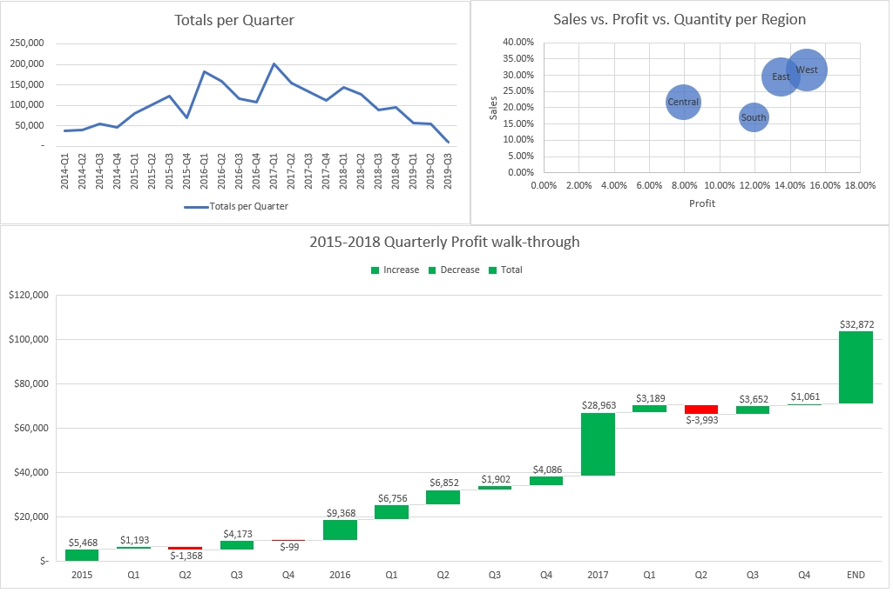
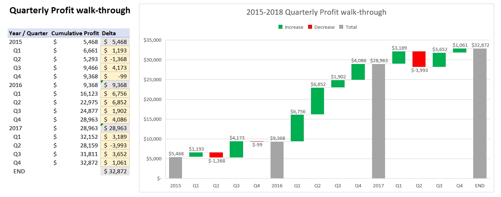
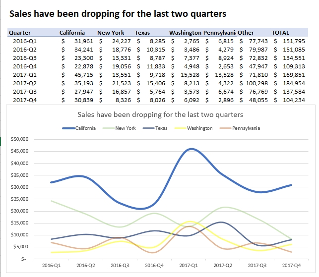

# DataCamp Excel Fundamentals Skill Track

This repository documents the completion of the **Excel Fundamentals Skill Track** on DataCamp, demonstrating my proficiency in essential data analysis and visualization techniques using Microsoft Excel.

---

## Course Details

* **Skill Track Name:** Excel Fundamentals
* **Platform:** DataCamp
* **Completion Date:** May 25, 2025
* **Duration:** 14 hours

---

## What I Learned / Key Skills Covered

This comprehensive skill track equipped me with core Excel skills, including:

* **Introduction to Excel:** Navigating the interface, basic operations, and understanding worksheets.
* **Data Preparation In Excel:** Cleaning, transforming, and organizing raw data for analysis (e.g., removing duplicates, handling missing values, text manipulation).
* **Data Visualization In Excel:** Creating various charts and graphs (e.g., bar charts, line charts, pie charts, scatter plots) to effectively communicate insights.
* **Data Analysis in Excel:** Using functions (SUMIFS, COUNTIFS, VLOOKUP, INDEX-MATCH), pivot tables, and other tools for data summarization and analysis.
* **Case Study: Analyzing Customer Churn In Excel:** Applying learned skills to a real-world scenario to identify and analyze customer churn patterns.

---

---

## Verification / Credential

You can verify the completion of this skill track through the official DataCamp accomplishment page or by viewing the downloaded certificate:

* **View Credential Online:** [Excel Fundamentals Skill Track on DataCamp](https://www.datacamp.com/completed/statement-of-accomplishment/track/7682713e43af74274522172c893630a589278a77)

---

## Certificate

If you'd like to view the full PDF certificate, it can be found here:

* [PDF Certificate](Excel_Fundamentals_Certificate.pdf)

---

## Contact

Feel free to connect with me on [LinkedIn](https://www.linkedin.com/in/ahmedayman99/) or reach out via email at [ahmedayman1077@gmail.com](mailto:ahmedayman1077@gmail.com).
